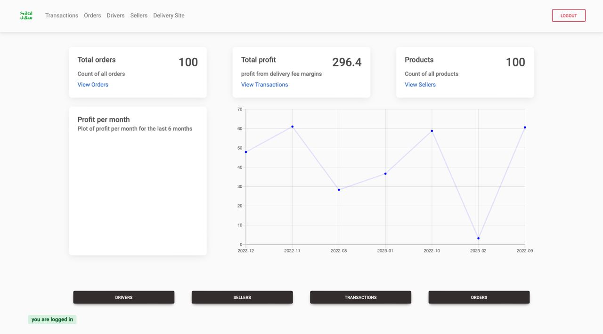
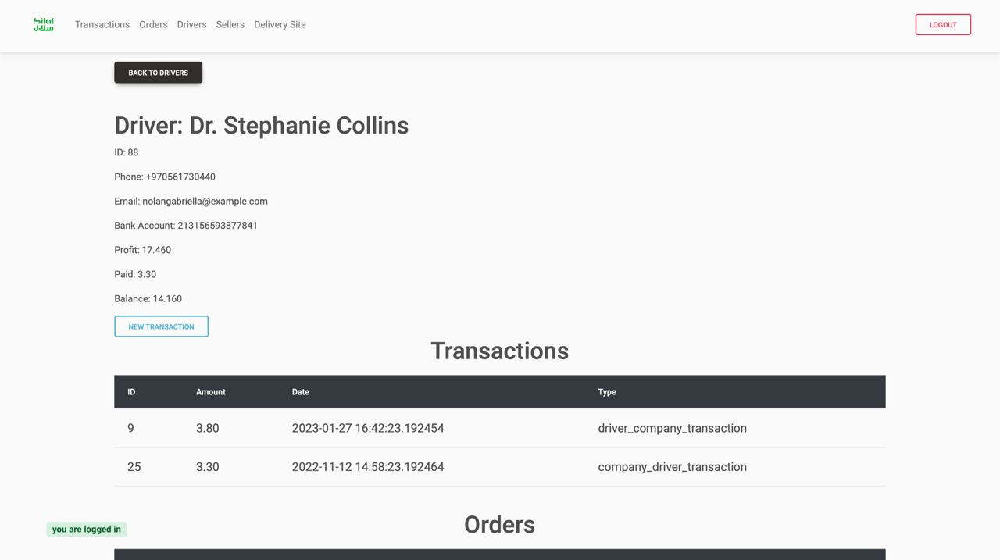
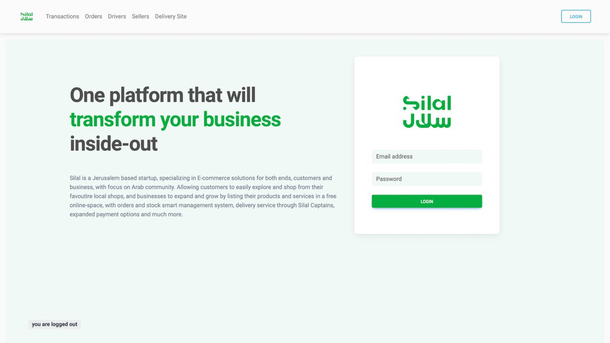
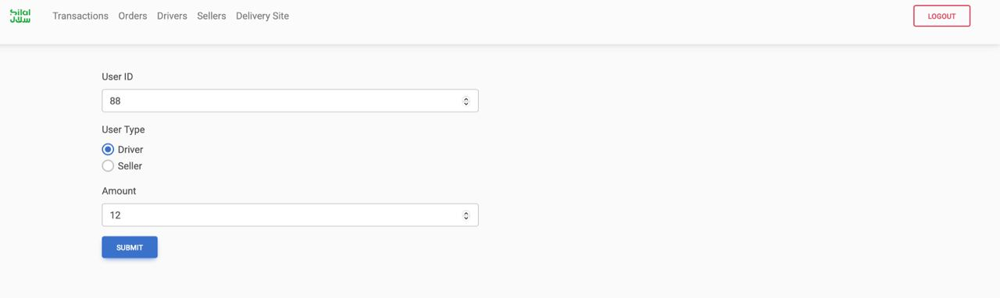

# Silal Payment System

A simple transaction database system for an e-commerce platform.

## Demo







## [Project Installation](./docs/Setup.md)

## Commands

### Run the project

```bash
flask run
```

### Reset DB

```bash
flask cli init-db
```

### Fill Random Mock Data

```bash
flask cli db-fill
```

> both can be used together like this: `flask cli init-db && flask cli db-fill`